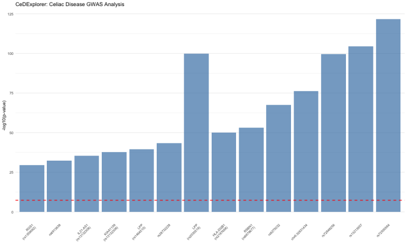

# CeDExplorer

Celiac Disease Gene Expression and GWAS Analysis Toolkit

## Description

CeDExplorer is an R package designed for comprehensive analysis of celiac disease genetic and expression data. It provides tools for GWAS visualization, gene expression analysis, protein-protein interaction networks, and HLA association studies to support celiac disease research. The package addresses the need for integrated analysis of multiple data types in celiac disease research by combining GWAS summary statistics, gene expression data, and protein interaction networks into a unified workflow.

This package was developed using R version 4.3.2 on macOS platform.

## Installation

To install the latest version of the package:

```r
install.packages("devtools")
library("devtools")
devtools::install_github("yuxi-wang-98/CeDExplorer", build_vignettes = TRUE)
library("CeDExplorer")
```

To run the shinyApp: Under construction

## Overview

```r
ls("package:CeDExplorer")
data(package = "CeDExplorer")
browseVignettes("CeDExplorer")
```

### Available Functions:

- `get_celiac_gwas()`: Retrieve celiac disease GWAS summary statistics
- `plot_top_gwas_hits()`: - Plots top GWAS associations as bar plot
- `plot_gwas_summary()`: - Creates GWAS summary visualization
- `expression_boxplot()`: Plot gene expression across conditions
- `score_inflammation_signature()`: Calculate inflammation signature scores
- `plot_gene_network()`: Visualize protein-protein interaction networks
- `hla_interaction_plot()`: Plot HLA allele frequency vs gene expression
- `geneEvidenceView()`: Composite dashboard for gene evidence integration
- `map_to_pathways()`: Map genes to pathways



## Contributions

**Yuxi Zhang**: Primary developer and author of the CeDExplorer package. Implemented all core functions including GWAS data retrieval, visualization tools, network analysis, and the composite dashboard system. Designed the package architecture and integrated multiple data analysis workflows.

**External Package Contributions:**
- `gwasrapidd`: Used for programmatic access to GWAS Catalog data
- `ggplot2`: Used for all visualization functions
- `igraph` & `ggraph`: Used for network analysis and visualization

**Data Sources:**
- GWAS Catalog: Primary source of celiac disease GWAS summary statistics
- EFO (Experimental Factor Ontology): For trait standardization

**Other packages**: 
- ggplot2 for data visualization
- igraph and ggraph for network analysis  
- testthat for unit testing

**Generative AI Assistance**: ChatGPT was used for:
- Function scaffolding and initial code structure
- Debugging assistance and error resolution
- Test case generation and documentation templates
- Code optimization suggestions

All AI-generated content was reviewed, validated, and integrated by the author.

## References

### R Packages

Allaire, J. J., Xie, Y., Dervieux, C., McPherson, J., Luraschi, J., Ushey, K., Atkins, A., Wickham, H., Cheng, J., Chang, W., & Iannone, R. (2025). *rmarkdown: Dynamic Documents for R* (Version 2.30) [Computer software]. https://github.com/rstudio/rmarkdown

Csárdi, G., Nepusz, T., Traag, V., Horvát, S., Zanini, F., Noom, D., Müller, K., Schoch, D., & Salmon, M. (2025). *igraph: Network Analysis and Visualization* (Version 2.2.1) [Computer software]. https://r.igraph.org/

Magno, R., & Maia, A.-T. (2025). *gwasrapidd: REST 'API' Client for the NHGRI-'EBI' GWAS Catalog* (Version 0.99.18) [Computer software]. https://github.com/ramiromagno/gwasrapidd

Pedersen, T. L. (2025). *ggraph: An Implementation of Grammar of Graphics for Graphs and Networks* (Version 2.2.2) [Computer software]. https://ggraph.data-imaginist.com

Pedersen, T. L. (2025). *patchwork: The Composer of Plots* (Version 1.3.2) [Computer software]. https://patchwork.data-imaginist.com

Wickham, H. (2025). *testthat: Unit Testing for R* (Version 3.2.3) [Computer software]. https://testthat.r-lib.org

Wickham, H., Chang, W., Henry, L., Pedersen, T. L., Takahashi, K., Wilke, C., Woo, K., Yutani, H., Dunnington, D., & van den Brand, T. (2025). *ggplot2: Create Elegant Data Visualisations Using the Grammar of Graphics* (Version 4.0.0) [Computer software]. https://ggplot2.tidyverse.org

Wickham, H., François, R., Henry, L., Müller, K., & Vaughan, D. (2023). *dplyr: A Grammar of Data Manipulation* (Version 1.1.4) [Computer software]. https://dplyr.tidyverse.org

Wickham, H., Vaughan, D., & Girlich, M. (2024). *tidyr: Tidy Messy Data* (Version 1.3.1) [Computer software]. https://tidyr.tidyverse.org

Xie, Y. (2025). *knitr: A General-Purpose Package for Dynamic Report Generation in R* (Version 1.50) [Computer software]. https://yihui.org/knitr/

### Books and Articles

Antonov, M., Csárdi, G., Horvát, S., Müller, K., Nepusz, T., Noom, D., Salmon, M., Traag, V., Welles, B. F., & Zanini, F. (2023). igraph enables fast and robust network analysis across programming languages. *arXiv preprint*. https://doi.org/10.48550/arXiv.2311.10260

Csárdi, G., & Nepusz, T. (2006). The igraph software package for complex network research. *InterJournal, Complex Systems, 1695*. https://igraph.org

Magno, R., & Maia, A.-T. (2019). gwasrapidd: an R package to query, download and wrangle GWAS Catalog data. *Bioinformatics*. https://doi.org/10.1093/bioinformatics/btz605

Wickham, H. (2011). testthat: Get Started with Testing. *The R Journal, 3*(1), 5–10. https://journal.r-project.org/archive/2011-1/RJournal_2011-1_Wickham.pdf

Wickham, H. (2016). *ggplot2: Elegant Graphics for Data Analysis*. Springer-Verlag. https://ggplot2.tidyverse.org

Xie, Y. (2015). *Dynamic Documents with R and knitr* (2nd ed.). Chapman and Hall/CRC.

Xie, Y. (2014). knitr: A Comprehensive Tool for Reproducible Research in R. In V. Stodden, F. Leisch, & R. D. Peng (Eds.), *Implementing Reproducible Computational Research*. Chapman and Hall/CRC.

Xie, Y., Allaire, J. J., & Grolemund, G. (2018). *R Markdown: The Definitive Guide*. Chapman and Hall/CRC. https://bookdown.org/yihui/rmarkdown

Xie, Y., Dervieux, C., & Riederer, E. (2020). *R Markdown Cookbook*. Chapman and Hall/CRC. https://bookdown.org/yihui/rmarkdown-cookbook

### Data Sources

Buniello, A., MacArthur, J. A. L., Cerezo, M., Harris, L. W., Hayhurst, J., Malangone, C., McMahon, A., Morales, J., Mountjoy, E., Sollis, E., Suveges, D., Vrousgou, O., Whetzel, P. L., Amode, R., Guillen, J. A., Riat, H. S., Trevanion, S. J., Hall, P., Junkins, H., ... Hindorff, L. A. (2019). The NHGRI-EBI GWAS Catalog of published genome-wide association studies, targeted arrays and summary statistics 2019. *Nucleic Acids Research, 47*(D1), D1005–D1012. https://doi.org/10.1093/nar/gky1120

Dubois, P. C., Trynka, G., Franke, L., Hunt, K. A., Romanos, J., Curtotti, A., Zhernakova, A., Heap, G. A., Adány, R., Aromaa, A., Bardella, M. T., van den Berg, L. H., Bockett, N. A., de la Concha, E. G., Dema, B., Fehrmann, R. S., Fernández-Arquero, M., Fiatal, S., Grandone, E., ... van Heel, D. A. (2010). Multiple common variants for celiac disease influencing immune gene expression. *Nature Genetics, 42*(4), 295–302. https://doi.org/10.1038/ng.543

## Acknowledgements

This package was developed as part of an assessment for 2025 BCB410H: Applied Bioinformatics course at the University of Toronto, Toronto, CANADA. CeDExplorer welcomes issues, enhancement requests, and other contributions. To submit an issue, use the GitHub issues.


