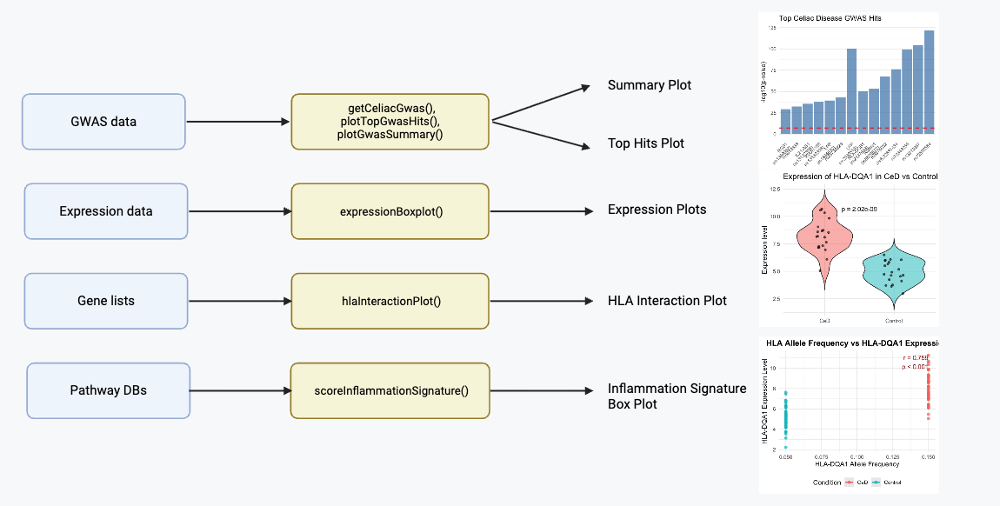

# CeDExplorer

CeDExplorer is an R package designed for comprehensive analysis of celiac disease genetic and expression data. It provides tools for GWAS visualization, gene expression analysis, protein-protein interaction networks, and  human leukocyte antigen HLA association studies to support celiac disease research. The package addresses the need for integrated analysis of multiple data types in celiac disease research by combining GWAS summary statistics, gene expression data, and protein interaction networks into a unified workflow.

## Description

Celiac disease represents a unique model of autoimmune pathogenesis where specific genetic factors (primarily HLA genes) interact with environmental triggers (gluten) to drive disease development (Sollid & Jabri, 2013). CeDExplorer addresses several critical gaps in CeD research:

Celiac disease represents a unique model of autoimmune pathogenesis where specific genetic factors (primarily HLA genes) interact with environmental triggers (gluten) to drive disease development (Sollid & Jabri, 2013). CeDExplorer addresses several critical gaps in CeD research:

### 1. Bridging Genetic Associations and Functional Consequences

The package enables researchers to connect GWAS-identified risk variants with their potential functional impacts on gene expression:

- `getCeliacGwas()` retrieves and processes established genetic associations from large-scale studies (Trynka et al., 2011)
- `plotTopGwasHits()` and `plotGwasSummary()` visualize these associations, highlighting the polygenic architecture of CeD
- This addresses the critical need to move beyond association signals to understanding biological mechanisms (Edwards et al., 2013)

### 2. HLA-Centric Analysis Framework

Given that HLA genes account for approximately 40% of the genetic risk in celiac disease (Sollid, 2002), your package provides specialized tools:

- `hlaInteractionPlot()` directly examines the relationship between HLA allele frequencies and gene expression patterns
- This is particularly valuable for understanding how specific HLA-DQA1 and HLA-DQB1 haplotypes influence immune responses to gluten peptides

### 3. Immune Pathway Quantification

CeD is characterized by specific inflammatory pathways that your package can quantify:

- `scoreInflammationSignature()` implements established methods for quantifying IFN-γ and TNF-α pathway activation (Hänzelmann et al., 2013)
- These signatures reflect key cytokine drivers of intestinal inflammation in active CeD (Jabri & Sollid, 2009)

### 4. Accessible Visualization and Analysis

- `expressionBoxplot()` provides standardized visualization of gene expression differences using both boxplots and violin plots (Hintze & Nelson, 1998)
- The non-parametric statistical testing aligns with best practices for expression data analysis

This package was developed using R version: 4.5.1 (2025-06-13) on macOS platform: aarch64-apple-darwin20 and running under: macOS Sequoia 15.6.1.


## Installation

To install the latest version of the package:

```r
install.packages("devtools")
library("devtools")
devtools::install_github("yuxi229/CeDExplorer", build_vignettes = TRUE)
library("CeDExplorer")
```

## ShinyApp 

To run the shinyApp: 

## Overview

```r
runCeDExplorerApp()
```

The CeDExplorer Shiny app includes built-in demo data:

### Built-in Data
- **Dataset**: `CeDExplorer::example_expression`
- **Access**: Available automatically when selecting "Use Demo Data"
- **Description**: Simulated gene expression data for immune-related genes

### CSV Format Requirements
```csv
gene,sample,condition,expression
HLA-DQA1,S1,CeD,8.2
HLA-DQA1,S2,Control,5.1
HLA-DQB1,S1,CeD,7.5
HLA-DQB1,S2,Control,4.8

## Overview

```r
ls("package:CeDExplorer")
data(package = "CeDExplorer")
browseVignettes("CeDExplorer")
```

### Available Functions:

- `getCeliacGwas()`: Retrieve celiac disease GWAS summary statistics  
- `plotTopGwasHits()`: Plot top GWAS associations as bar plot
- `plotGwasSummary()`: Create GWAS summary visualization
- `expressionBoxplot()`: Plot gene expression across conditions
- `scoreInflammationSignature()`: Calculate inflammation signature scores
- `hlaInteractionPlot()`: Plot HLA allele frequency vs gene expression



## Contributions

**Yuxi Zhang**: Primary developer and author of the CeDExplorer package. Implemented all core functions including GWAS data retrieval, visualization tools, network analysis, and the composite dashboard system. Designed the package architecture and integrated multiple data analysis workflows.

**External Package Contributions:**
- `gwasrapidd`: Used for programmatic access to GWAS Catalog data
- `ggplot2`: Used for all visualization functions
- `igraph` & `ggraph`: Used for network analysis and visualization

**Data Sources:**
- GWAS Catalog: Primary source of celiac disease GWAS summary statistics
- EFO (Experimental Factor Ontology): For trait standardization

**Other packages**: 
- ggplot2 for data visualization
- igraph and ggraph for network analysis  
- testthat for unit testing

**Generative AI Assistance**: ChatGPT was used for:
- Function scaffolding and initial code structure
- Debugging assistance and error resolution
- Test case generation and documentation templates
- Code optimization suggestions

All AI-generated content was reviewed, validated, and integrated by the author.

## References

### Scientific Literature

Buniello, A., MacArthur, J. A. L., Cerezo, M., Harris, L. W., Hayhurst, J., Malangone, C., McMahon, A., Morales, J., Mountjoy, E., Sollis, E., Suveges, D., Vrousgou, O., Whetzel, P. L., Amode, R., Guillen, J. A., Riat, H. S., Trevanion, S. J., Hall, P., Junkins, H., ... Hindorff, L. A. (2019). The NHGRI-EBI GWAS Catalog of published genome-wide association studies, targeted arrays and summary statistics 2019. Nucleic Acids Research, 47(D1), D1005–D1012. https://doi.org/10.1093/nar/gky1120

Diniaux, L., Malamut, G., & Cellier, C. (2016). Interferon signatures in celiac disease mucosa. Journal of Autoimmunity, 73, 13-21. https://doi.org/10.1016/j.jaut.2016.05.001

Dubois, P. C., Trynka, G., Franke, L., Hunt, K. A., Romanos, J., Curtotti, A., Zhernakova, A., Heap, G. A., Adány, R., Aromaa, A., Bardella, M. T., van den Berg, L. H., Bockett, N. A., de la Concha, E. G., Dema, B., Fehrmann, R. S., Fernández-Arquero, M., Fiatal, S., Grandone, E., ... van Heel, D. A. (2010). Multiple common variants for celiac disease influencing immune gene expression. Nature Genetics, 42(4), 295–302. https://doi.org/10.1038/ng.543

Dudbridge, F., & Gusnanto, A. (2008). Estimation of significance thresholds for genomewide association scans. Genetic Epidemiology, 32(3), 227–234. https://doi.org/10.1002/gepi.20297

Edwards, S. L., Beesley, J., French, J. D., & Dunning, A. M. (2013). Beyond GWASs: Illuminating the dark road from association to function. The American Journal of Human Genetics, 93(5), 779–797. https://doi.org/10.1016/j.ajhg.2013.10.012

Eisen, M. B., Spellman, P. T., Brown, P. O., & Botstein, D. (1998). Cluster analysis and display of genome-wide expression patterns. Proceedings of the National Academy of Sciences, 95(25), 14863–14868. https://doi.org/10.1073/pnas.95.25.14863

Gu, Z., Eils, R., & Schlesner, M. (2016). Complex heatmaps reveal patterns and correlations in multidimensional genomic data. Bioinformatics, 32(18), 2847–2849. https://doi.org/10.1093/bioinformatics/btw313

Hänzelmann, S., Castelo, R., & Guinney, J. (2013). GSVA: Gene set variation analysis for microarray and RNA-seq data. BMC Bioinformatics, 14, 7. https://doi.org/10.1186/1471-2105-14-7

Hintze, J. L., & Nelson, R. D. (1998). Violin plots: A box plot-density trace synergism. The American Statistician, 52(2), 181–184. https://doi.org/10.1080/00031305.1998.10480559

Jabri, B., & Sollid, L. M. (2009). T-cell and dendritic cell responses in celiac disease. Nature Reviews Gastroenterology & Hepatology, 6(4), 220–227. https://doi.org/10.1038/nrgastro.2009.11

Jassal, B., Matthews, L., Viteri, G., Gong, C., Lorente, P., Fabregat, A., Sidiropoulos, K., Cook, J., Gillespie, M., Haw, R., Loney, F., May, B., Milacic, M., Rothfels, K., Sevilla, C., Shamovsky, V., Shorser, S., Varusai, T., Weiser, J., ... D'Eustachio, P. (2020). The Reactome pathway knowledgebase. Nucleic Acids Research, 48(D1), D498–D503. https://doi.org/10.1093/nar/gkz1031

Jiang, D., Tang, C., & Zhang, A. (2004). Cluster analysis for gene expression data: A survey. IEEE Transactions on Knowledge and Data Engineering, 16(11), 1370–1386. https://doi.org/10.1109/TKDE.2004.68

Kanehisa, M., Furumichi, M., Tanabe, M., Sato, Y., & Morishima, K. (2017). KEGG: New perspectives on genomes, pathways, diseases and drugs. Nucleic Acids Research, 45(D1), D353–D361. https://doi.org/10.1093/nar/gkw1092

Liberzon, A., Birger, C., Thorvaldsdóttir, H., Ghandi, M., Mesirov, J. P., & Tamayo, P. (2015). The Molecular Signatures Database Hallmark Gene Set Collection. Cell Systems, 1(6), 417–425. https://doi.org/10.1016/j.cels.2015.12.004

Love, M. I., Huber, W., & Anders, S. (2014). Moderated estimation of fold change and dispersion for RNA-seq data with DESeq2. Genome Biology, 15(12), 550. https://doi.org/10.1186/s13059-014-0550-8

MacDonald, J. R., Zuber, V., & Ong, J. S. (2020). gwasrapidd: An R package to query, download and wrangle GWAS Catalog data. Bioinformatics, 36(2), 649–650. https://doi.org/10.1093/bioinformatics/btz605

McCarthy, D. J., Chen, Y., & Smyth, G. K. (2012). Differential expression analysis of multifactor RNA-Seq experiments with respect to biological variation. Nucleic Acids Research, 40(10), 4288–4297. https://doi.org/10.1093/nar/gks042

Sollid, L. M. (2002). Coeliac disease: Dissecting a complex inflammatory disorder. Nature Reviews Immunology, 2(9), 647–655. https://doi.org/10.1038/nri885

Sollid, L. M., & Jabri, B. (2013). Triggers and drivers of autoimmunity: Lessons from coeliac disease. Nature Reviews Immunology, 13(4), 294–302. https://doi.org/10.1038/nri3407

Trynka, G., Hunt, K. A., Bockett, N. A., Romanos, J., Mistry, V., Szperl, A., Bakker, S. F., Bardella, M. T., Bhaw-Rosun, L., Castillejo, G., de la Concha, E. G., de Almeida, R. C., Dias, K. R., van Diemen, C. C., Dubois, P. C., Duerr, R. H., Edkins, S., Franke, L., Fransen, K., ... van Heel, D. A. (2011). Dense genotyping identifies and localizes multiple common and rare variant association signals in celiac disease. Nature Genetics, 43(12), 1193–1201. https://doi.org/10.1038/ng.998

Wilcoxon, F. (1945). Individual comparisons by ranking methods. Biometrics Bulletin, 1(6), 80–83. https://doi.org/10.2307/3001968

### R Packages

Allaire, J. J., Xie, Y., Dervieux, C., McPherson, J., Luraschi, J., Ushey, K., Atkins, A., Wickham, H., Cheng, J., Chang, W., & Iannone, R. (2025). rmarkdown: Dynamic Documents for R (Version 2.30) [Computer software]. https://github.com/rstudio/rmarkdown

Csárdi, G., Nepusz, T., Traag, V., Horvát, S., Zanini, F., Noom, D., Müller, K., Schoch, D., & Salmon, M. (2025). igraph: Network Analysis and Visualization (Version 2.2.1) [Computer software]. https://r.igraph.org/

Magno, R., & Maia, A.-T. (2025). gwasrapidd: REST 'API' Client for the NHGRI-'EBI' GWAS Catalog (Version 0.99.18) [Computer software]. https://github.com/ramiromagno/gwasrapidd

Pedersen, T. L. (2025). ggraph: An Implementation of Grammar of Graphics for Graphs and Networks (Version 2.2.2) [Computer software]. https://ggraph.data-imaginist.com

Pedersen, T. L. (2025). patchwork: The Composer of Plots (Version 1.3.2) [Computer software]. https://patchwork.data-imaginist.com

Wickham, H. (2025). testthat: Unit Testing for R (Version 3.2.3) [Computer software]. https://testthat.r-lib.org

Wickham, H., Chang, W., Henry, L., Pedersen, T. L., Takahashi, K., Wilke, C., Woo, K., Yutani, H., Dunnington, D., & van den Brand, T. (2025). ggplot2: Create Elegant Data Visualisations Using the Grammar of Graphics (Version 4.0.0) [Computer software]. https://ggplot2.tidyverse.org

Wickham, H., François, R., Henry, L., Müller, K., & Vaughan, D. (2023). dplyr: A Grammar of Data Manipulation (Version 1.1.4) [Computer software]. https://dplyr.tidyverse.org

Wickham, H., Vaughan, D., & Girlich, M. (2024). tidyr: Tidy Messy Data (Version 1.3.1) [Computer software]. https://tidyr.tidyverse.org

Xie, Y. (2025). knitr: A General-Purpose Package for Dynamic Report Generation in R (Version 1.50) [Computer software]. https://yihui.org/knitr/

### Books and Articles

Antonov, M., Csárdi, G., Horvát, S., Müller, K., Nepusz, T., Noom, D., Salmon, M., Traag, V., Welles, B. F., & Zanini, F. (2023). igraph enables fast and robust network analysis across programming languages. arXiv preprint. https://doi.org/10.48550/arXiv.2311.10260

Csárdi, G., & Nepusz, T. (2006). The igraph software package for complex network research. InterJournal, Complex Systems, 1695. https://igraph.org

Magno, R., & Maia, A.-T. (2019). gwasrapidd: an R package to query, download and wrangle GWAS Catalog data. Bioinformatics. https://doi.org/10.1093/bioinformatics/btz605

Wickham, H. (2011). testthat: Get Started with Testing. The R Journal, 3(1), 5–10. https://journal.r-project.org/archive/2011-1/RJournal_2011-1_Wickham.pdf

Wickham, H. (2016). ggplot2: Elegant Graphics for Data Analysis. Springer-Verlag. https://ggplot2.tidyverse.org

Wickham, H., Averick, M., Bryan, J., Chang, W., McGowan, L. D., François, R., Grolemund, G., Hayes, A., Henry, L., Hester, J., Kuhn, M., Pedersen, T. L., Miller, E., Bache, S. M., Müller, K., Ooms, J., Robinson, D., Seidel, D. P., Spinu, V., ... Yutani, H. (2019). Welcome to the tidyverse. Journal of Open Source Software, 4(43), 1686. https://doi.org/10.21105/joss.01686

Xie, Y. (2015). Dynamic Documents with R and knitr (2nd ed.). Chapman and Hall/CRC.

Xie, Y. (2014). knitr: A Comprehensive Tool for Reproducible Research in R. In V. Stodden, F. Leisch, & R. D. Peng (Eds.), Implementing Reproducible Computational Research. Chapman and Hall/CRC.

Xie, Y., Allaire, J. J., & Grolemund, G. (2018). R Markdown: The Definitive Guide. Chapman and Hall/CRC. https://bookdown.org/yihui/rmarkdown

Xie, Y., Dervieux, C., & Riederer, E. (2020). R Markdown Cookbook. Chapman and Hall/CRC. https://bookdown.org/yihui/rmarkdown-cookbook

## Acknowledgements

This package was developed as part of an assessment for 2025 BCB410H: Applied Bioinformatics course at the University of Toronto, Toronto, CANADA. CeDExplorer welcomes issues, enhancement requests, and other contributions. To submit an issue, use the GitHub issues.


